# Team 5 Mist 4610 Group Project 1

## Team Name:

71552 Group 5
##  Team Members:

1. Brian Michaels - https://github.com/bmichaels914/4610-Group-5-Project-1/blob/55e44c0680e301e1a109035a9557309b69cff217/README.md
3. Kush Konduru
4. Pierce Jennings - https://github.com/PierceJ-MIS/4610-Group-5-Project-1/blob/c1464054eed714c5429824d215c0d16218bbc2db/README.md 
5. Simran Kansara
6. Rohan Reddy - https://github.com/rohanreddy0205-debug/4610-Group-5-Project-1/blob/ab6f804d2c6ac0af37a628b9b025cb2357b9732c/README.md

## Problem Description: 

This new boutique fitness studio needs a relational database model to keep track of its business operations. This database must efficiently manage data regarding memberships, respective trainers, and class capacity to meet consumer needs. In addition, the model must reflect internal processes including suppliers for new equipment and enrollment to prevent exceeding physical capacity. Without a structured system, the boutique may overbook classes, order new equipment from the inappropriate supplier, and overall fail to meet consumer needs, resulting in a decrease in revenue. By building this data model, we seek to minimize these disruptions by building a variety of entities with sample data in each table. Entities and their relationships with one another represent the direct concepts the boutique focuses on. By writing queries to test our model, we ensure that this relational database reflects an accurate system for the business boutique.  

## Data Model:

## Data Dictionary:

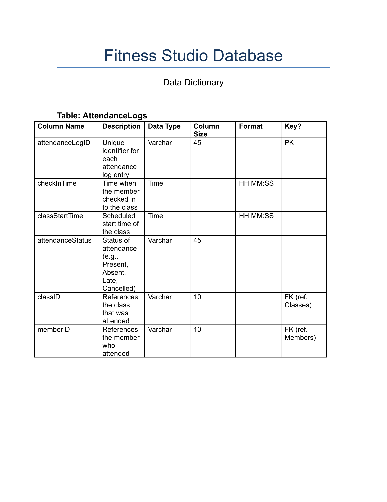

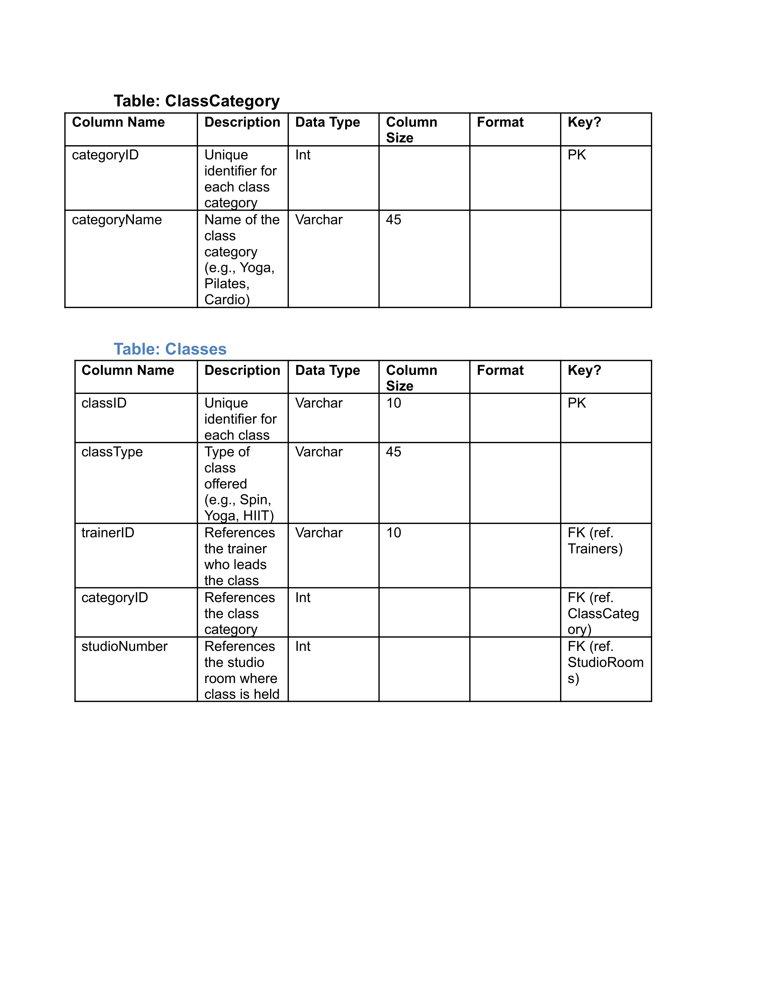

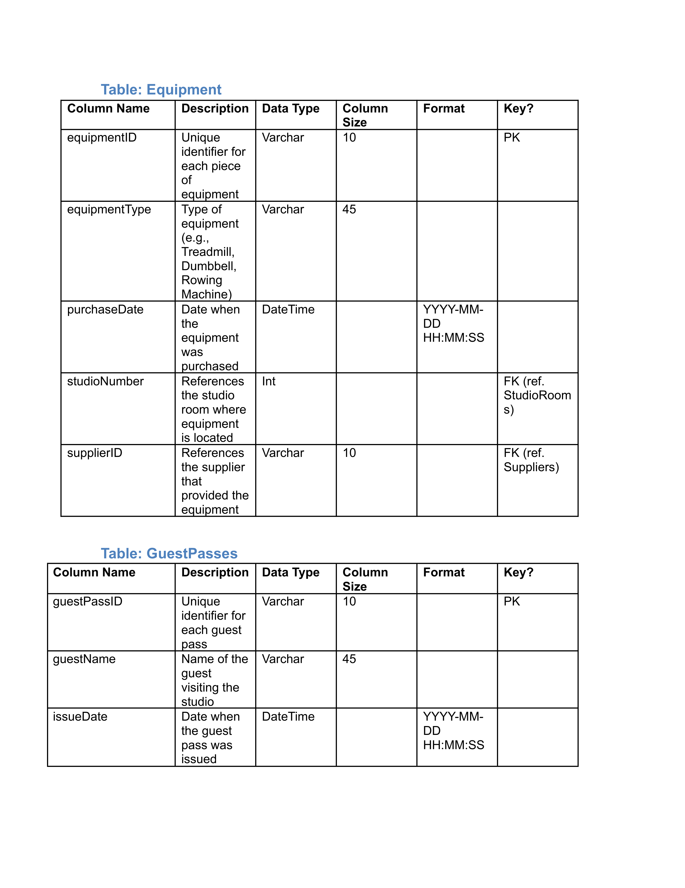

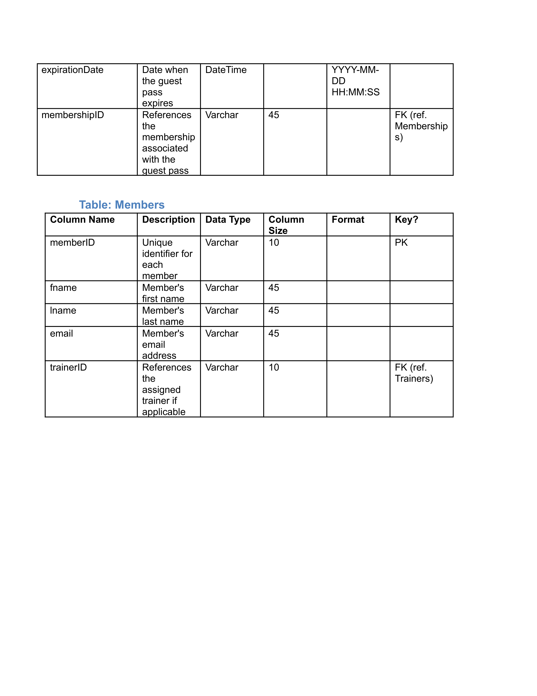

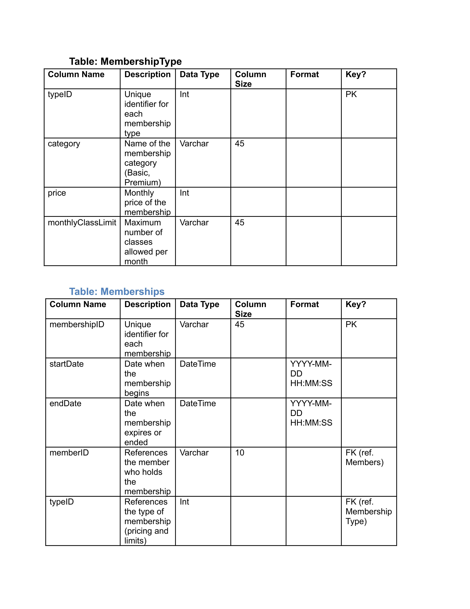

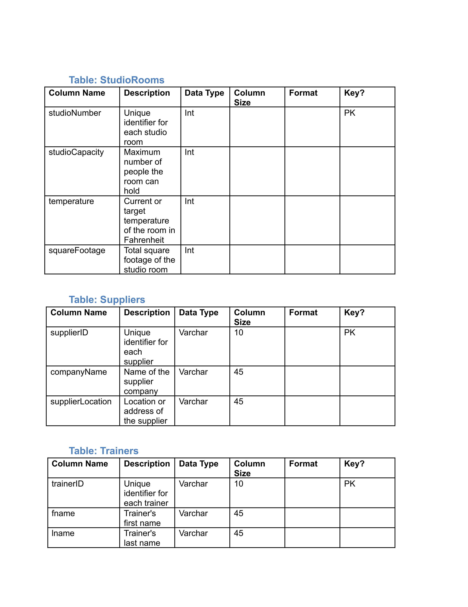

## Queries: 

Query 1: Which trainers have managed more than 10 total attendees across all their classes?

Justification: This query allows management to evaluate each trainer's performance when it comes to optimizing class capacity.

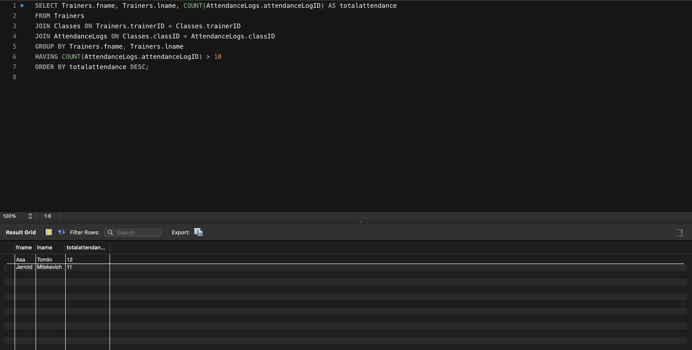

Query 2: List all equipment purchased more 250 days ago that is located in high-temperature rooms. (high temperature > 75 degrees)

Justification: Heat and heavy use can accelerate equipment wear. This query acts as a proactive maintenance tool to prevent injury or unexpected repair costs by identifying gear likely to fail

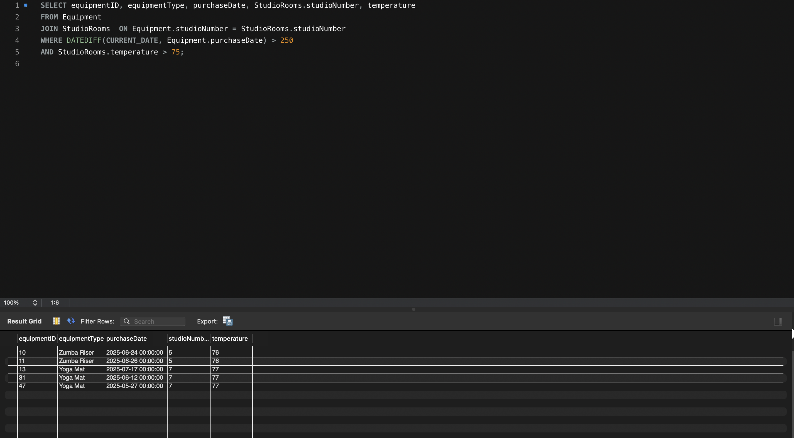

Query 3: Which guest passes are expiring within the next 3 days?

Justification: These guests represent the warmest leads for the sales team. Managers can use this list to trigger a "final offer" or follow-up call to convert the guest into a full member before they leave the studio ecosystem.

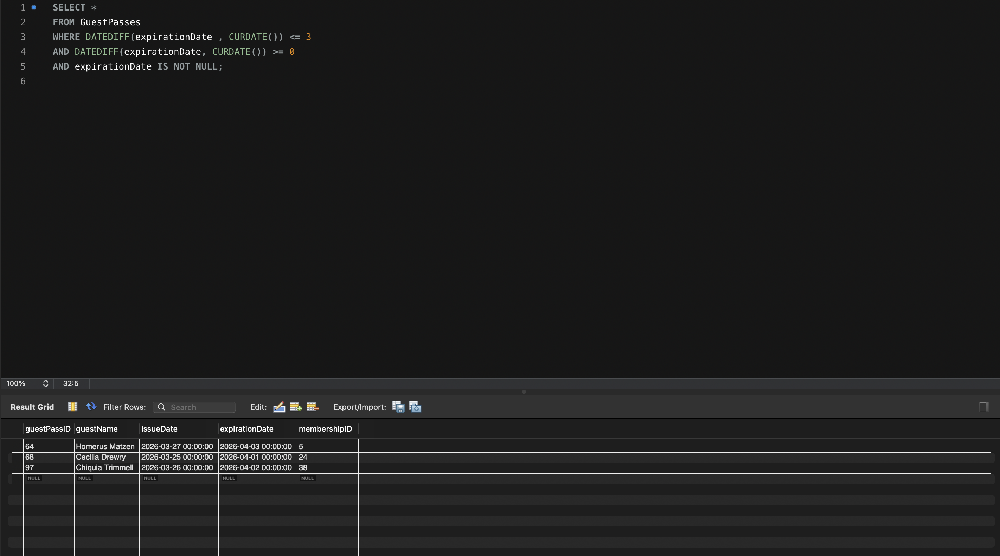

Query 4: Write a query that returns each member's first and last name, the names of any guests they have brought in, and the total number of guest passes issued per guest, including members who have never brought a guest.

Justification: This helps management identify which members are actively using their guest pass privileges, which can inform decisions around upselling premium memberships or rewarding highly engaged members who are bringing in potential new clients.

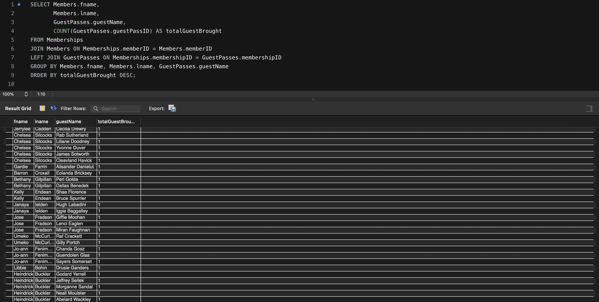

Query 5: List the studio’s suppliers in the order of quantity of equipment provided to our studio?

Justification: Over-reliance on a single supplier can be a business risk if that supplier faces delays or price hikes. This helps management diversify their vendor list for better bargaining power

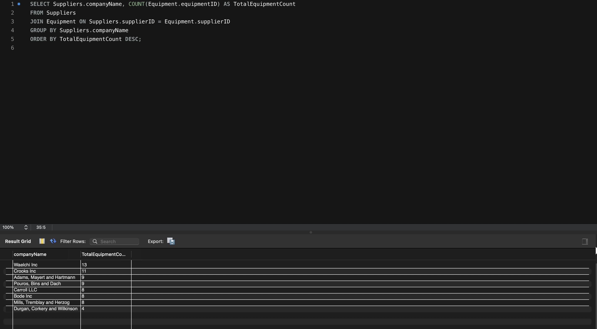

Query 6: Identify the members of the studio that are not currently in a membership

Justification: Members who are not currently paying for a membership are an easy target for revenue-growth. If they have paid for a membership in the past and need to renew for another year, they should be a priority for retention.

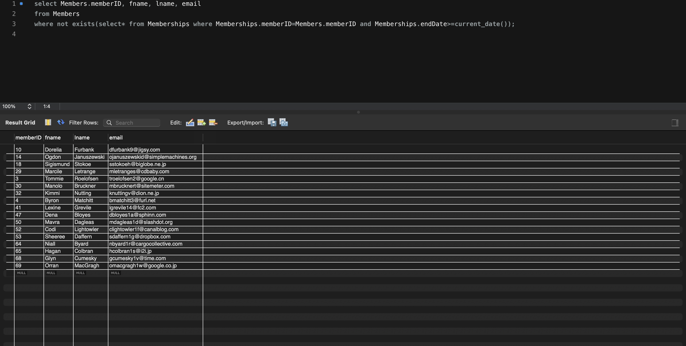

Query 7: Write a query to list the number of total classes the fitness studio offers for each category.

Justification: A fitness studio manager would benefit from knowing the number of classes offered per category because it provides a clear snapshot of whether the studio's schedule is balanced and aligned with member demand. If certain categories are over- or under-represented, the manager can make informed decisions about adding, removing, or redistributing classes to better serve the membership base. This insight also supports staffing decisions, ensuring that trainer specialties and availability are proportionate to the volume of classes being offered in each category.

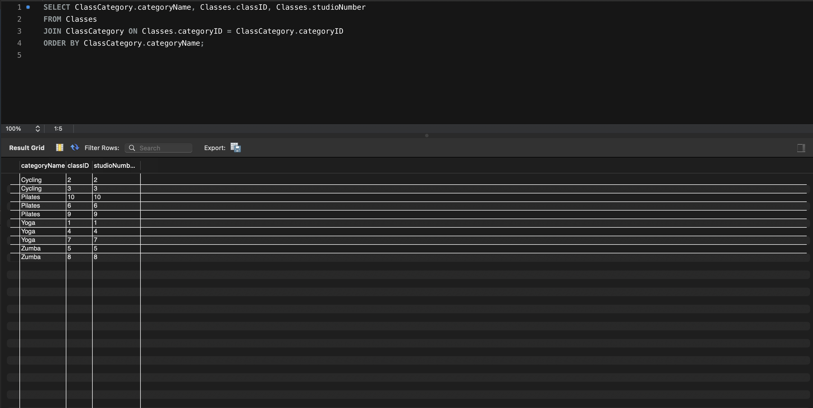

Query 8: Which members have issued guest passes, who were those passes given to, and are those passes currently active or expired — and what membership tier does the issuing member hold?

Justification: A fitness studio manager would want this information to monitor whether the guest pass program is being used as intended and exclusively by eligible membership tiers. Guests with recently expired passes also represent strong conversion opportunities, as they have already demonstrated interest in the studio.

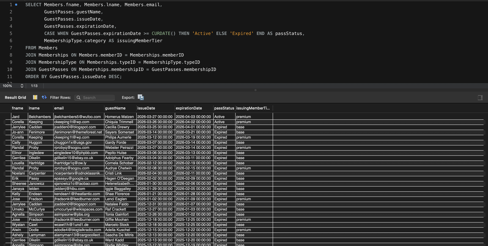

Query 9: Write a query to list the directory of staffed trainers, highlighting each of their ID, name, email, and specialty.

Justification: A fitness studio manager would want a complete trainer directory to have a centralized reference for all staff contact information and specialties, making it easy to assign trainers to classes that align with their expertise. This also serves as a quick resource when members inquire about which trainer is best suited for their fitness goals.

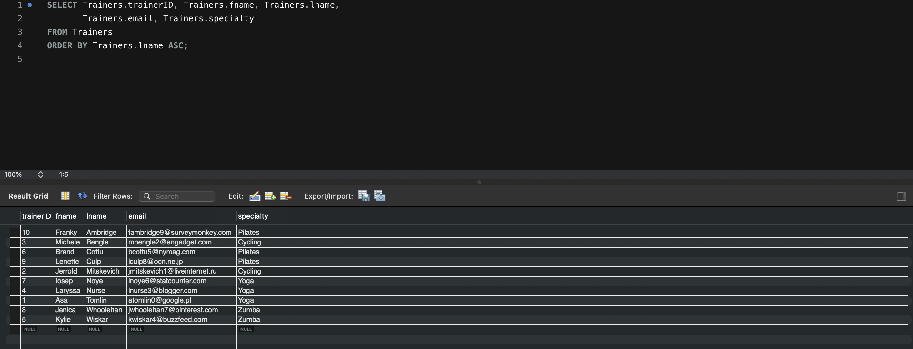

Query 10: Write a query that returns the member ID, first name, last name, and email of all members who have at least one attendance log on record.

Justification: This allows management to distinguish active members from those who have never checked into a class, which is critical for retention outreach and identifying at-risk memberships before they lapse.

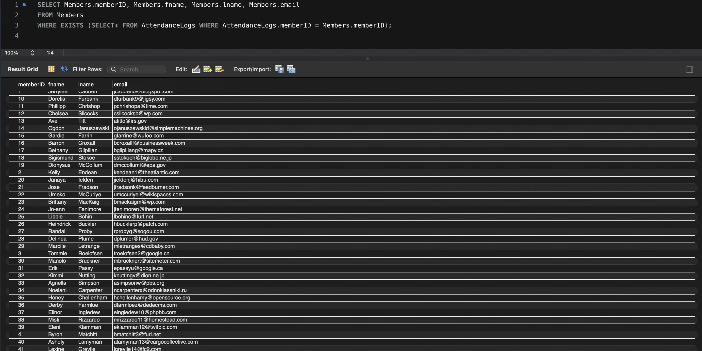

## Database information:

Name of Database: ns_Sp26_71552_Group5

Additional information: All of our created queries can be called using this format: CALL TP_Q1();, CALL TP_Q2();, CALL TP_Q3();, and so on.

